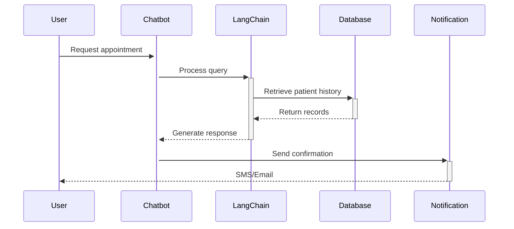

# 🏥 Medical Appointment Chatbot [](https://www.python.org/) [](https://opensource.org/licenses/MIT)


A LangChain-powered chatbot for managing medical appointments with:
- 📅 Natural language scheduling
- 📚 PDF knowledge base integration
- 📱 SMS/Email notifications
- 🌐 Web interface (FastAPI)
- 🔒 HIPAA-compliant data handling


## Features
- Natural language appointment scheduling
- PDF document knowledge base (emergency procedures, clinic info)
- SMS/Email notifications
- RAG integration using LangChain
- Web interface (FastAPI)
- Patient record management

## Installation

```bash
git clone https://github.com/yourusername/medical-chatbot.git
cd medical-chatbot
python -m venv .venv
source .venv/bin/activate  # Linux/MacOS
# .venv\Scripts\activate  # Windows

pip install -r requirements.txt
```

## Configuration

1. Copy example environment file:
```bash
cp .env.example .env
```

2. Update `.env` with your credentials:
```ini
OPENAI_API_KEY=your_openai_key
TWILIO_SID=your_twilio_sid
TWILIO_TOKEN=your_twilio_token
SMTP_USER=your_email@example.com
SMTP_PASSWORD=your_email_password
```

## 🖥️ Usage

### Local Development
```bash
# Start development server with hot reload
uvicorn web.main:app --reload

# Run CLI interface
python appointment_agent.py

# Start Redis for caching
docker run -p 6379:6379 redis:6-alpine
```

### Production Setup
```bash
# Build and start with Docker Compose
docker compose up --build -d

# Scale horizontally
docker compose scale app=3
```

### First-Time Setup Diagram


## 🚢 Deployment

### Production Environment Variables
```ini
DEPLOYMENT_ENV=production
DATABASE_URL=postgresql://user:password@db:5432/medical_chatbot
REDIS_URL=redis://cache:6379/0
SSL_ENABLED=true
```

### Deployment Options

1. **Docker Compose (Recommended)**
```yaml
version: '3.8'

services:
  app:
    build: .
    ports:
      - "8000:8000"
    environment:
      - DEPLOYMENT_ENV=production
    depends_on:
      - db
      - redis

  db:
    image: postgres:13
    environment:
      POSTGRES_PASSWORD: medicalchatbot
    volumes:
      - pgdata:/var/lib/postgresql/data

  redis:
    image: redis:6-alpine
    volumes:
      - redisdata:/data

volumes:
  pgdata:
  redisdata:
```

2. **Kubernetes**
[Full deployment guide available in docs/deployment.md](docs/deployment.md)

3. **Cloud Providers**
[](https://aws.amazon.com/ecs/)
Sample ECS task definition included in `deploy/aws-ecs-task.json`

### Monitoring
```bash
# View logs
docker compose logs -f

# Health check
curl http://localhost:8000/health

# Metrics endpoint
curl http://localhost:8000/metrics
```

## API Documentation

### Key Endpoints
| Endpoint | Method | Description |
|----------|--------|-------------|
| `/health` | GET | System health status and version |
| `/chat` | WS | Real-time chat interface (WebSocket) |
| `/api/appointments` | POST | Create new appointment (JSON payload) |
| `/api/history` | GET | Retrieve chat history (JWT protected) |

## Development Setup

```bash
# Install development dependencies
pip install -r requirements-dev.txt

# Run with hot reload
uvicorn web.main:app --reload

# Run tests
pytest tests/

# Lint code
flake8 .

# Format code
black .
```

## Documentation Structure
```
/medical-chatbot
├── web/               # Web interface components
│   ├── main.py        # FastAPI application
│   └── templates/     # HTML templates
├── data/              # Document storage
│   └── clinic_docs/   # PDF knowledge base
├── src/               # Core logic
│   ├── rag/           # RAG components
│   └── notifications/ # Notification services
├── tests/             # Test suite
├── requirements.txt   # Production dependencies
├── requirements-dev.txt # Development dependencies
└── README.md          # Documentation
```

## Security Notes
- Always use HTTPS in production
- Store secrets in environment variables (never in code)
- Regularly rotate API keys
- Review `security.md` for complete guidelines

## License
MIT License