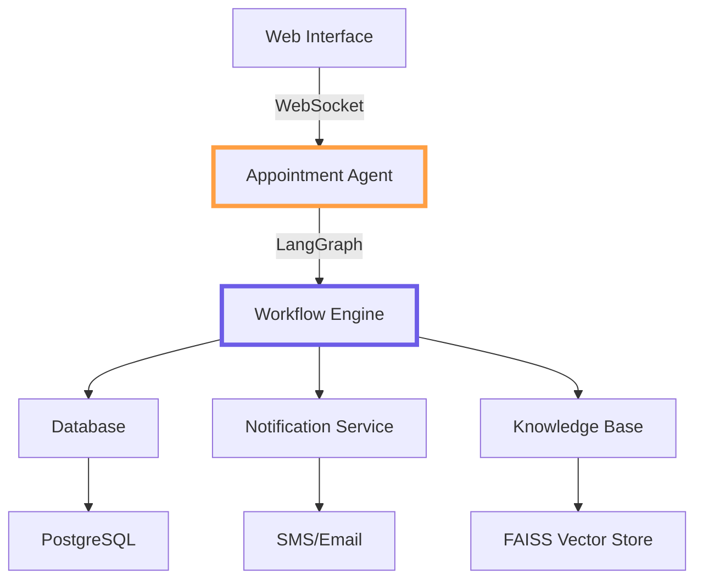
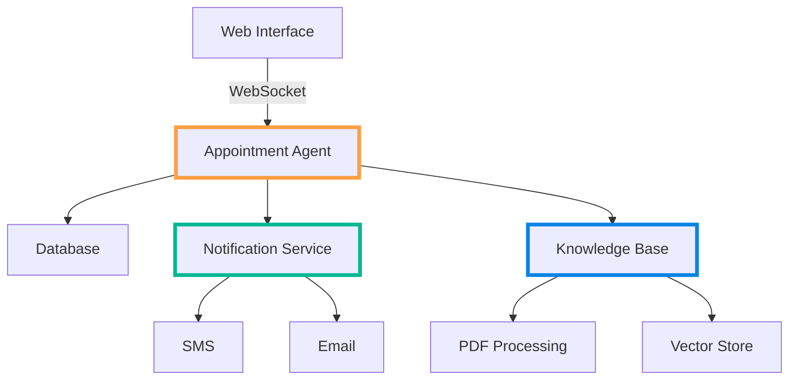

# 🏥 Medical Appointment Chatbot [](https://www.python.org/) [](https://opensource.org/licenses/MIT)

A LangChain + LangGraph-powered chatbot for managing medical appointments with:
- 📅 Natural language scheduling with validation
- 🔄 Automatic retry mechanisms
- 📚 PDF knowledge base integration (RAG)
- 📱 Multi-channel notifications with fallback
- 🌐 Secure WebSocket interface (FastAPI)
- 🔒 HIPAA-compliant data handling
- 📊 Comprehensive logging and monitoring

## Key Features
- **Reliable Scheduling**:
  - Input validation for patient/doctor IDs
  - Database transaction management
  - Automatic retries for failed operations

- **Knowledge Integration**:
  - PDF document processing with error handling
  - Configurable chunk sizes for embeddings
  - Automatic document validation

- **Notification System**:
  - SMS/Email with channel fallback
  - Retry logic for failed deliveries
  - Message templating

- **Web Interface**:
  - Secure WebSocket communication
  - CORS configuration
  - Request validation
  - Rate limiting

## 🛠️ Enhanced Architecture (LangGraph Version)

The system now uses LangGraph for state management and workflow orchestration:





## Installation & Setup (Updated Requirements)

```bash
# Install with production dependencies including LangGraph
pip install -r requirements.txt langgraph
```
```bash
# Clone and setup
git clone https://github.com/yourusername/medical-chatbot.git
cd medical-chatbot
python -m venv .venv
source .venv/bin/activate  # Linux/MacOS

# Install with production dependencies
pip install -r requirements.txt

# Configure environment
cp .env.example .env
```

## Configuration Highlights
```ini
# Core Services
OPENAI_API_KEY=your_key
DB_HOST=postgres
DB_NAME=medical_chatbot

# Notifications
TWILIO_SID=your_sid
TWILIO_TOKEN=your_token
PREFERRED_CHANNEL=sms  # or 'email'

# Performance
CHUNK_SIZE=1000        # RAG processing
MAX_RETRIES=3          # Operation retries
```

## 🚀 Running the System
```bash
# Development
uvicorn web.main:app --reload

# Production
docker compose up --build -d

# Monitoring
docker compose logs -f app
```

## Monitoring Endpoints
| Endpoint | Description |
|----------|-------------|
| `/health` | System status and version |
| `/metrics` | Prometheus metrics |
| `/logs` | Recent application logs |

## Error Handling
The system implements comprehensive error handling:
- Automatic retries for transient failures
- Circuit breakers for external services
- Detailed error logging
- Graceful degradation

```python
@retry(stop=stop_after_attempt(3))
def critical_operation():
    try:
        # Operation logic
    except Exception as e:
        logger.error(f"Operation failed: {e}")
        raise
```

## Security Features
- Environment variable secrets
- Input validation
- HTTPS enforcement
- CORS restrictions
- Request rate limiting
- Audit logging

## 📈 Deployment Options
1. **Docker Compose** - Full stack with Postgres/Redis
2. **Kubernetes** - For scalable deployments
3. **AWS ECS** - Cloud deployment templates included

## Development
```bash
# Run tests
pytest tests/

# Lint and format
flake8 .
black .

# Generate docs
mkdocs build
```

## Documentation Structure
```
/docs
├── architecture.md     # System design
├── api.md              # Endpoint documentation
├── deployment.md       # Deployment guides
└── security.md         # Security practices
```

## License
MIT License - See [LICENSE](LICENSE) for details