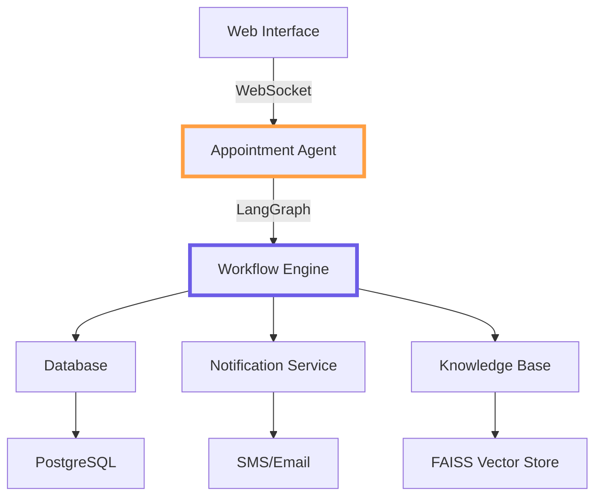

# System Architecture (LangGraph Version)

```mermaid
graph TD
    A[Web Interface] -->|WebSocket| B[Appointment Agent]
    B -->|LangGraph| C[Workflow Engine]
    C --> D[Database]
    C --> E[Notification Service]
    C --> F[Knowledge Base]
    D --> G[PostgreSQL]
    E --> H[SMS/Email]
    F --> I[FAISS Vector Store]
    
    style C stroke:#6c5ce7,stroke-width:4px
    style B stroke:#ff9f43,stroke-width:4px
```